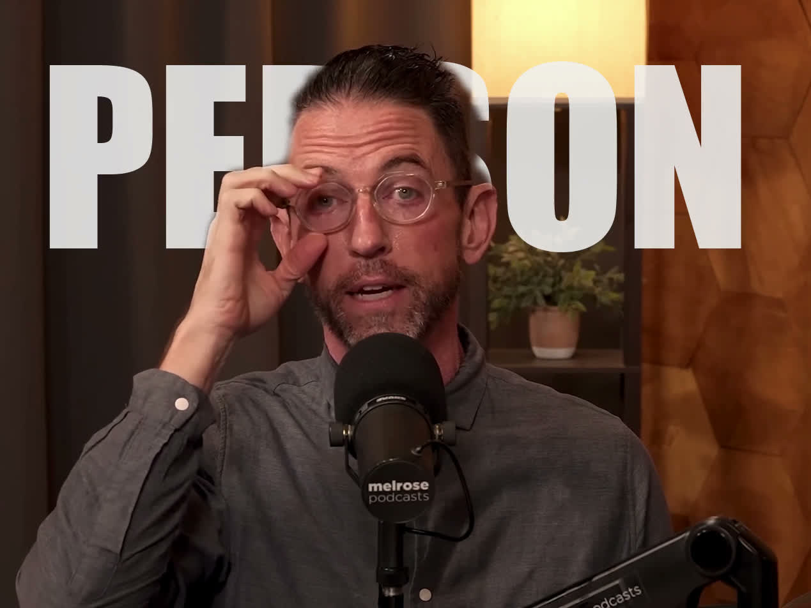

# DepthCaptions

Add word-by-word captions that appear **behind the person** in a video.

Each spoken word is transcribed with Whisper, rendered at full frame-width, and composited between the background and the subject using MediaPipe segmentation — so the text reads through the person like a depth effect.



---

## Install

**Requirements:** Python 3.10+, `ffmpeg` on PATH (`brew install ffmpeg`)

```bash
git clone https://github.com/luisadrianpuga/DepthCaptions
cd DepthCaptions
pip install -e .
```

> **Note:** requires `numpy<2` due to MediaPipe/TensorFlow compatibility.

---

## Use as a CLI

```bash
depthcaptions input.mp4 output.mp4

# Options
depthcaptions input.mp4 output.mp4 \
  --whisper-model small \
  --opacity 0.70 \
  --y-position 0.38 \
  --font /path/to/font.ttf
```

Or as a module:

```bash
python -m depthcaptions input.mp4 output.mp4
```

---

## Use as a Claude Code skill (MCP)

### 1. Install the package

```bash
pip install -e /path/to/DepthCaptions
```

### 2. Add to Claude Code settings

Open `~/.claude/settings.json` and add:

```json
{
  "mcpServers": {
    "depthcaptions": {
      "command": "/usr/local/bin/python3",
      "args": ["/path/to/DepthCaptions/server.py"]
    }
  }
}
```

Or via the Claude Code CLI:

```bash
claude mcp add depthcaptions /usr/local/bin/python3 -- /path/to/DepthCaptions/server.py
```

### 3. Use it in Claude Code

Once connected, just ask Claude:

> *"Add captions to ~/Videos/clip.mp4 and save to ~/Videos/clip_captioned.mp4"*

Claude will call `add_captions` with sensible defaults. You can also ask it to adjust opacity, position, or use a different Whisper model.

---

## Configuration

| Parameter | Default | Notes |
|---|---|---|
| `whisper_model` | `base` | `tiny` / `base` / `small` / `medium` / `large` |
| `text_opacity` | `0.72` | 0.0 = invisible, 1.0 = solid |
| `text_y_position` | `0.38` | 0.0 = top, 1.0 = bottom |
| `text_fill_width` | `0.88` | Word scales to fill this fraction of frame width |
| `font_path` | auto | Path to `.ttf` — defaults to Impact or Helvetica |
| `segmentation_threshold` | `0.6` | MediaPipe confidence cutoff |
| `mask_blur_radius` | `5` | Edge feathering on person mask (pixels) |

---

## Pipeline

```
input.mp4
  │
  ├─ Whisper ──────────────────► word timestamps
  │
  └─ per frame:
       ├─ MediaPipe segmentation ► person mask
       ├─ PIL text render        ► word on background (with opacity)
       └─ OpenCV composite       ► background + text + person on top
                                           │
                                    output.mp4 (ffmpeg)
```

The segmentation model (`selfie_segmenter.tflite`) is downloaded automatically on first run to `~/.depthcaptions/models/`.
